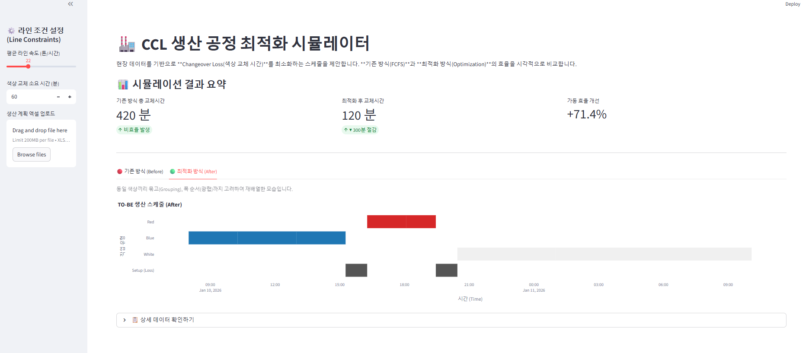

# S&OP 생산 부하량 & Capa 분석기 (Capacity Planning Simulator)

### 1. 프로젝트 개요 (Overview)
제조업의 만성적인 갈등인 **영업(수주)과 생산(공급)의 불일치**를 해결하기 위한 의사결정 지원 시스템(DSS)입니다.
공장의 최대 생산 능력(Capa) 대비 현재 수주된 부하량(Load)을 시각화하고, **Over-Capa(초과 물량)** 발생 시 잔업/특근 또는 외주 처리에 따른 비용과 효과를 시뮬레이션합니다.

### 2. 핵심 기능 (Key Features)
* **🏭 공장 기초 체력 설정:** UPH(시간당 생산량), 가동 일수, 설비 효율(OEE)을 조정하여 정확한 월간 Capa 산출.
* **📊 부하율(Load Ratio) 시각화:** 게이지 차트(Gauge Chart)를 통해 공장 가동 상태(안전/주의/위험)를 직관적으로 모니터링.
* **🚨 문제 해결 시뮬레이션 (What-If):**
    * **생산 부족 시:** 주말 특근 투입 시 해결 가능 여부 자동 계산.
    * **외주 전환 시:** 추가 발생하는 비용(Cost) 자동 산출.

### 3. 비즈니스 로직 (Business Logic)
현업 생산관리(PC) 부서에서 사용하는 로직을 그대로 구현했습니다.
1.  **Standard Capacity:** $UPH \times Working Hours \times Days \times Efficiency$
2.  **Load Ratio:** $(Total Demand / Capacity) \times 100$
3.  **Decision Making:**
    * Load Ratio > 100%: 잔업(Overtime) 또는 외주(Outsourcing) 의사결정 필요
    * Load Ratio < 80%: 유휴 설비 발생 (영업 독려 필요)

### 4. 사용 기술 (Tech Stack)
* **Language:** Python 3.9
* **Library:** Streamlit, Plotly (Gauge Chart & Interactive Dashboards)

### 5. 실행 화면 (Demo)

> **[시나리오 분석 예시]**
> * **상황:** 수주량이 공장 Capa를 20% 초과하여 납기 지연 위기 발생
> * **시뮬레이션:** 주말 특근 2일 추가 투입 시, 부하율이 120% → 98%로 감소하여 자체 생산 가능함 판명.

### 6. 실행 방법
```bash
pip install streamlit plotly
python -m streamlit run sop_planner.py
